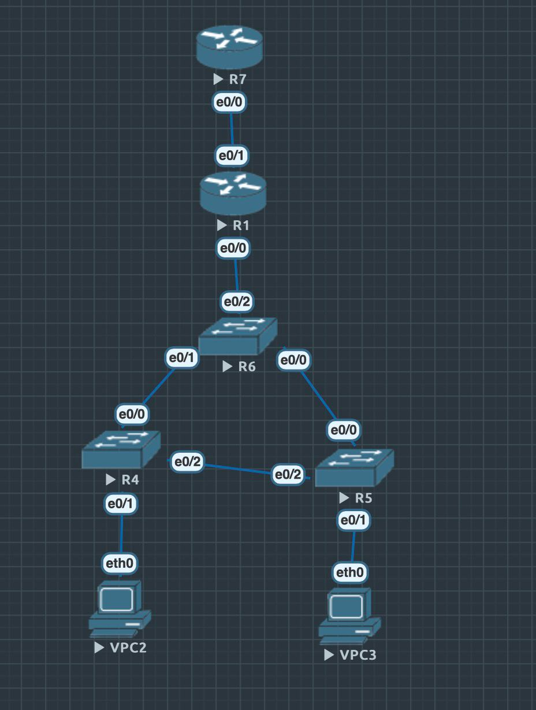

=======
## Топология




## VPC2

```
ip dhcp
```

## VPC3

```
ip dhcp
```

#### Switch не меняются

## R4

```
config terminal
(config)#vlan 10
(config-vlan)#exit
(config)#vlan 20
(config-vlan)#exit
(config)#interface e0/1
(config-if)#switchport mode access
(config-if)#switchport access vlan 10
(config-if)#exit
(config)#interface e0/0
(config-if)#switchport trunk encapsulation dot1q
(config-if)#switchport trunk allowed vlan 10,20
(config-if)#switchport mode trunk
(config-if)#exit
(config)#interface e0/2
(config-if)#switchport trunk encapsulation dot1q
(config-if)#switchport trunk allowed vlan 10,20
(config-if)#switchport mode trunk
(config-if)#exit
(config)#vtp mode transparent
(config)#exit
write

```

## R5
```
config terminal
(config)#vlan 10
(config-vlan)#exit
(config)#vlan 20
(config-vlan)#exit
(config)#interface e0/1
(config-if)#switchport mode access
(config-if)#switchport access vlan 20
(config-if)#exit
(config)#interface e0/0
(config-if)#switchport trunk encapsulation dot1q
(config-if)#switchport trunk allowed vlan 10,20
(config-if)#switchport mode trunk
(config-if)#exit
(config)#interface e0/2
(config-if)#switchport trunk encapsulation dot1q
(config-if)#switchport trunk allowed vlan 10,20
(config-if)#switchport mode trunk
(config-if)#exit
(config)#vtp mode transparent
(config)#exit
write
```
## R6

```
config terminal
(config)#vlan 10
(config-vlan)#exit
(config)#vlan 20
(config-vlan)#exit
(config)#interface e0/2
(config-if)#switchport trunk encapsulation dot1q
(config-if)#switchport trunk allowed vlan 10,20
(config-if)#switchport mode trunk
(config-if)#exit
(config)#interface e0/1
(config-if)#switchport trunk encapsulation dot1q
(config-if)#switchport trunk allowed vlan 10,20
(config-if)#switchport mode trunk
(config-if)#exit
(config)#interface e0/0
(config-if)#switchport trunk encapsulation dot1q
(config-if)#switchport trunk allowed vlan 10,20
(config-if)#switchport mode trunk
(config-if)#exit
(config)#spanning-tree vlan 1 root primary
(config)#spanning-tree vlan 10 root primary
(config)#spanning-tree vlan 20 root primary
(config)#vtp mode transparent
(config)#exit
write
```

## R1
```
config terminal
(config)#interface e0/0
(config-if)#no shutdown
(config-if)#exit
(config)#interface e0/0
(config)#interface e0/0.10
(config-subif)#encapsulation dot1Q 10
(config-subif)#ip address 10.0.10.1 255.255.255.0
(config-subif)#exit
(config)#interface e0/0.20
(config-subif)#encapsulation dot1Q 20
(config-subif)#ip address 10.0.20.1 255.255.255.0
(config-subif)#exit
///////////////////////////////////////////////
(config)#ip dhcp pool first
(dhcp-config)#network 10.0.10.0 255.255.255.0
(dhcp-config)#dns-server 8.8.8.8
(dhcp-config)#default-router 10.0.10.1
(config)#ip dhcp excluded-address 10.0.10.0 10.0.10.10
(dhcp-config)#exit

(config)#ip dhcp pool second
(dhcp-config)#network 10.0.20.0 255.255.255.0
(dhcp-config)#dns-server 8.8.8.8
(dhcp-config)#default-router 10.0.20.1
(config)#ip dhcp excluded-address 10.0.20.0 10.0.20.10
(dhcp-config)#exit

(config)#ip nat pool POOL 11.0.10.10 11.0.10.20 netmask 255.255.255.0

(config)#interface e0/0
(config-if)#ip nat inside
(config-if)#exit

(config)#interface e0/0.10
(config-subif)#ip nat inside
(config-subif)#exit

(config)#interface e0/0.20
(config-subif)#ip nat inside
(config-subif)#exit

(config)#interface e0/1
(config-if)#no shutdown
(config-if)#ip address 11.0.10.1 255.255.255.0
(config-if)#ip nat outside
(config-if)#exit

(config)#access-list 100 permit ip 10.0.10.0 0.0.0.255 any
(config)#access-list 100 permit ip 10.0.20.0 0.0.0.255 any
(config)#ip nat inside source list 100 pool POOL
(config)#exit
write
```

## R7
config terminal
(config)#interface e0/0
(config-if)#no shutdown
(config-if)#ip address 11.0.10.2 255.255.255.0
(config-if)#exit
write