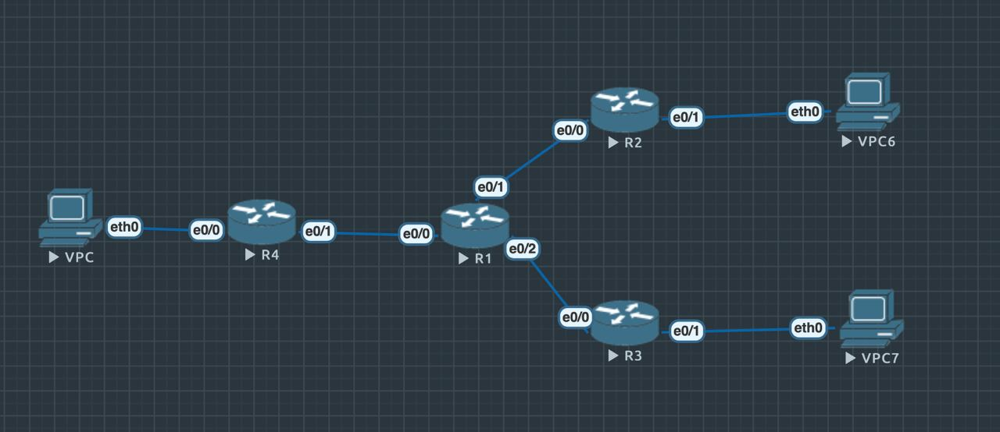

## Топология



## VPC

```
ip 10.0.10.2 255.255.255.0 10.0.10.1
```


## R1

```
config terminal
(config)#interface e0/0
(config-if)#no shutdown
(config-if)#ip address 1.1.10.1 255.255.255.0
(config)#interface e0/1
(config-if)#ip address 1.1.20.1 255.255.255.0
(config-if)#no shutdown
```

## R2

```
config terminal
(config)#interface e0/0
(config-if)#no shutdown
(config-if)#ip address 1.1.20.2 255.255.255.0
(config-if)#interface e0/1
(config-if)#no shutdown
(config-if)#ip address 10.0.20.1 255.255.255.0
(config)#exit
(config)#interface Tunnel100
(config-if)#ip address 172.16.10.2 255.255.255.0
(config-if)# ip mtu 1400
(config-if)# ip tcp adjust-mss 1360
(config-if)# tunnel source 1.1.20.2
(config-if)#tunnel destination 1.1.10.2
(config)#ip route 0.0.0.0 0.0.0.0 1.1.20.1
(config)#ip route 10.0.10.2 255.255.255.255 172.16.10.1
(config)#exit
```

## R3

```
config terminal
(config)#interface e0/0
(config-if)#no shutdown
(config-if)#ip address 1.1.30.2 255.255.255.0
(config)#interface e0/1
(config-if)#no shutdown
(config-if)#ip address 10.0.30.1 255.255.255.0
(config)#interface Tunnel200
(config-if)#ip address 172.16.11.2 255.255.255.0
(config-if)#ip mtu 1400
(config-if)#ip tcp adjust-mss 1360
(config-if)#tunnel source 1.1.30.2
(config-if)#tunnel destination 1.1.10.2
(config)#ip route 0.0.0.0 0.0.0.0 1.1.30.1
(config)#exit
(config)#ip route 10.0.10.2 255.255.255.255 172.16.11.1
(config)#crypto isakmp policy 1
(config-isakmp)#encr 3des
(config-isakmp)#hash md5
(config-isakmp)#authentication pre-share
(config-isakmp)#group 2
(config-isakmp)#lifetime 86400
(config-isakmp)#exit
(config)#crypto isakmp key merionet address 1.1.10.2
(config)#crypto ipsec transform-set TS esp-3des esp-md5-hmac
(cfg-crypto-trans)#mode transport
(cfg-crypto-trans)#exit
(config)#crypto ipsec profile protect-gre
(ipsec-profile)#set security-association lifetime seconds 86400
(ipsec-profile)#set transform-set TS
(ipsec-profile)#exit
(config)#interface Tunnel 200
(config-if)#tunnel protection ipsec profile protect-gre

(config)#exit
```

## R4

```
config terminal
(config)#interface e0/0
(config-if)#no shutdown
(config-if)#ip address 10.0.10.1 255.255.255.0
(config)#interface e0/1
(config-if)#ip address 1.1.10.2 255.255.255.0
(config-if)#no shutdown
(config)#interface Tunnel100
(config-if)#ip address 172.16.10.1 255.255.255.0
(config-if)#ip mtu 1400
(config-if)#ip tcp adjust-mss 1360
(config-if)# tunnel source 1.1.10.2
(config-if)#tunnel destination 1.1.20.2
(config)#ip route 0.0.0.0 0.0.0.0 1.1.10.1
(config)#ip route 10.0.20.2 255.255.255.255 172.16.10.2
(config)#interface Tunnel200
(config-if)#ip address 172.16.11.1 255.255.255.0
(config-if)#ip mtu 1400
(config-if)#ip tcp adjust-mss 1360
(config-if)#tunnel source 1.1.10.2
(config-if)#tunnel destination 1.1.30.2
(config)#crypto isakmp policy 1
(config-isakmp)#encr 3des
(config-isakmp)#hash md5
(config-isakmp)#authentication pre-share
(config-isakmp)#group 2
(config-isakmp)#lifetime 86400
(config-isakmp)#exit
(config)#crypto isakmp key merionet address 1.1.30.2
(config)#crypto ipsec transform-set TS esp-3des esp-md5-hmac
(cfg-crypto-trans)#mode transport
(cfg-crypto-trans)#exit
(config)#crypto ipsec profile protect-gre
(ipsec-profile)#set security-association lifetime seconds 86400
(ipsec-profile)#set transform-set TS
(ipsec-profile)#exit
(config)#interface Tunnel200
(config-if)#tunnel protection ipsec profile protect-gre

```

## VPC6

```
ip 10.0.20.2 255.255.255.0 10.0.20.1
```

## VPC7

```
ip 10.0.20.2 255.255.255.0 10.0.20.1
```